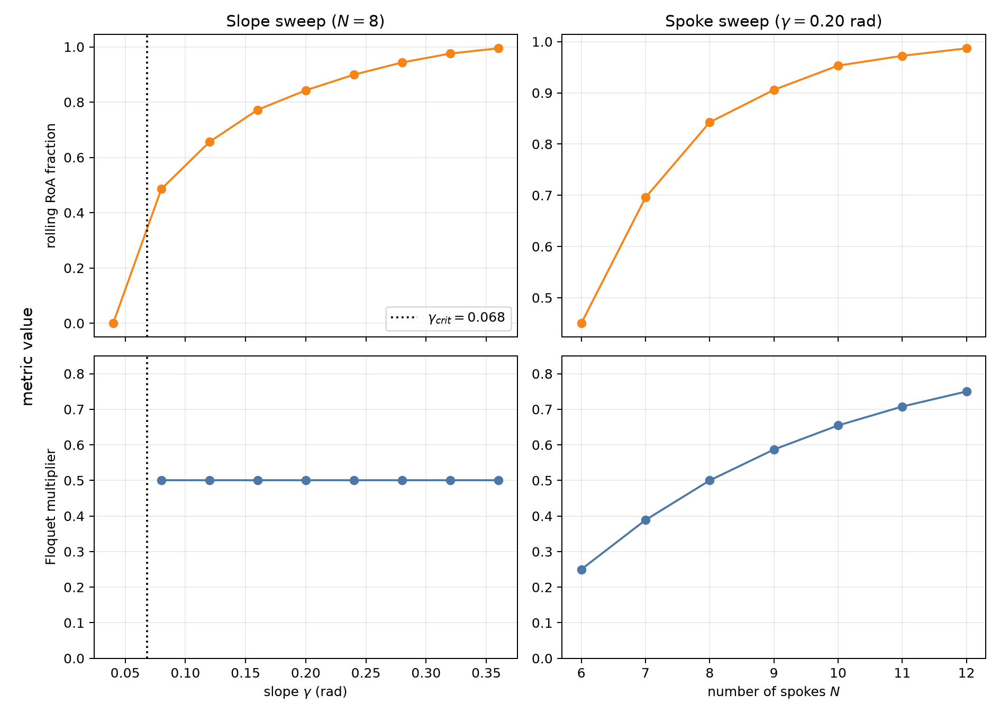

# Assignment 1: Rimless-Wheel Dynamics and Stability

```console
uv sync --python 3.14
uv run python assignment_1.py
uv run pytest -q
```

## sketch


## Sanity checks

Before running the stability analysis I expected four basic behaviors:

1. Mechanical energy should be constant during every undamped swing.
2. Contact should occur at exactly $\gamma+\alpha$ (or $\gamma-\alpha$ when
   moving backward), rather than one integration step beyond it.
3. The coordinate should jump by $2\alpha$, potential energy should remain
   continuous at contact, and kinetic energy should be multiplied by
   $\cos^2(2\alpha)$.
4. A rolling initial condition should converge step by step to a repeatable
   post-impact speed.

I used RK4 with $\Delta t=10^{-3}$ s and bisected each detected guard crossing.
For a 10 s rolling simulation, the largest swing-energy discrepancy was
$7.91\times10^{-12}$ J. The largest recorded guard-angle, reset-angle, and
reset-speed errors were all below the stored double-precision resolution
(reported as 0). The speed converged to 1.224397 rad/s, and the energy plot has
constant plateaus separated only by the expected plastic-impact losses. Thus
all four observations matched the predictions.


## Regions of attraction

I evaluated every cell of a $121\times181$ grid on the physically admissible
single-stance domain

$$
\theta\in[\gamma-\alpha,\gamma+\alpha],\qquad
\dot\theta\sqrt{l/g}\in[-1.25,1.25].
$$

The grid uses cell centers, so no sample is placed artificially on a contact
guard. Between impacts I advance the ideal swing exactly using conserved
energy, then iterate the complete signed contact map for at most 150 impacts.
This event-driven brute-force simulation avoids the small-timestep error at the
nonsmooth reset. A state is rolling when its post-impact speed is within
$10^{-3}\sqrt{g/l}$ of the rolling fixed point and still on the downhill-crossing
branch. A state is standing when the signed map drives its speed within that
tolerance of zero.

There are two stable attractors for the nominal parameters:

- the double-support standing fixed point; and
- the downhill rolling limit cycle.

Of the 21,901 initial states, 57.550% converged to rolling and 42.450% converged
to standing; none remained unresolved. A coarser $61\times91$ grid gave 57.503%
rolling, a change of only 0.047 percentage points. The isolated single-spoke
state $(0,0)$ is an unstable equilibrium/separatrix, not a stable attractor.
The black curve below is one period of the rolling orbit and the dotted segment
is its impact reset.


The percentages above are bounded RoA fractions for the explicitly stated
window, not measures over an unbounded velocity space.

## Poincare return map and Floquet multiplier

I use the state immediately after a contact as the Poincare section. A positive
section speed implies $\theta^+=\gamma-\alpha$; a negative speed implies
$\theta^+=\gamma+\alpha$. For the rolling branch, conservation of energy and
the impact reset give

$$
P(\omega)=c\sqrt{\omega^2+A},\qquad
c=\cos(2\alpha),\qquad
A=4\frac{g}{l}\sin\alpha\sin\gamma.
$$

The full signed map in the plot also includes the direction-reversing standing
branch and the uphill branch. Its two separatrix thresholds are
$\omega_2=-1.527617$ rad/s and $\omega_1=0.913491$ rad/s; at either exact value
the wheel approaches $(0,0)$ asymptotically and never returns to the section.


The event-localized RK4 samples intersect the identity line at
$\omega^*=1.224397107$ rad/s. The closed-form value is 1.224397113 rad/s, a
difference of $6.27\times10^{-9}$ rad/s.

For the requested two-sided perturbation, I used
$\delta=0.01\omega^*$ and evaluated the numerical map at
$\omega^*-\delta$, $\omega^*$, and $\omega^*+\delta$. The one-sided slopes were
0.498744 and 0.501244, and the centered Floquet estimate was

$$
\lambda\approx\frac{P(\omega^*+\delta)-P(\omega^*-\delta)}{2\delta}
=0.499994.
$$

The analytic derivative is $P'(\omega^*)=\cos^2(2\alpha)=0.500000$. Since
$|\lambda|<1$, the rolling orbit is locally exponentially stable; a small
post-impact speed error is approximately halved every step.

## Slope and spoke-count sweeps

For fair RoA comparisons, every sweep used a $101\times161$ cell-centered grid
with the same normalized coordinates
$q=(\theta-\gamma)/\alpha\in[-1,1]$ and
$v=\dot\theta\sqrt{l/g}\in[-1.25,1.25]$.



### Slope

With $N=8$, a finite-period rolling fixed point first exists above

$$
\gamma_{crit}=2\tan^{-1}\!\left[\tan(\alpha/2)\tan^2\alpha\right]
=0.068229\text{ rad}.
$$

| $\gamma$ (rad) | rolling RoA | $\omega^*$ (rad/s) | $\lambda$ |
|---:|---:|---:|---:|
| 0.04 | 0.00% | no rolling cycle | N/A |
| 0.08 | 48.56% | 1.0955 | 0.5000 |
| 0.12 | 65.58% | 1.3408 | 0.5000 |
| 0.16 | 77.22% | 1.5467 | 0.5000 |
| 0.20 | 84.26% | 1.7272 | 0.5000 |
| 0.24 | 89.93% | 1.8893 | 0.5000 |
| 0.28 | 94.34% | 2.0371 | 0.5000 |
| 0.32 | 97.57% | 2.1734 | 0.5000 |
| 0.36 | 99.45% | 2.3000 | 0.5000 |

A steeper slope adds more gravitational energy per step and reduces the speed
needed to vault the hub over the stance spoke, so the rolling basin grows. The
largest tested RoA is therefore at $\gamma=0.36$ rad. In this ideal model the
slope changes the gait speed and basin but not local convergence: algebraically
$P'(\omega^*)=\cos^2(2\alpha)$, so every viable $N=8$ gait has
$\lambda=0.5$. Thus all viable tested slopes tie for fastest local convergence
per step.

### Number of spokes

I held $\gamma=0.20$ rad for $N=6,\ldots,12$. This is above the largest onset
slope (0.178160 rad for $N=6$) and below the smallest $\alpha$ (0.261799 rad for
$N=12$), so both attractors exist in every case and the comparison does not
silently drop nonexistent cycles.

| $N$ | rolling RoA | $\omega^*$ (rad/s) | $\lambda$ |
|---:|---:|---:|---:|
| 6 | 45.01% | 1.1399 | 0.2500 |
| 7 | 69.56% | 1.4667 | 0.3887 |
| 8 | 84.26% | 1.7272 | 0.5000 |
| 9 | 90.58% | 1.9460 | 0.5868 |
| 10 | 95.31% | 2.1363 | 0.6545 |
| 11 | 97.23% | 2.3060 | 0.7077 |
| 12 | 98.69% | 2.4603 | 0.7500 |

More spokes shorten the angular distance to the next contact and lower the
vaulting barrier, so the bounded rolling basin increases. The tradeoff is
slower local convergence per step: $\cos^2(2\pi/N)$ rises from 0.25 at six
spokes to 0.75 at twelve. Six spokes reject a perturbation fastest, while twelve
spokes give the broadest tested basin. This statement is per step; convergence
per unit time or distance can differ because step period and step length also
change.

## Assumptions and references

This analysis uses the assignment's ideal point-mass, massless-spoke, no-slip,
perfectly plastic-impact model. It omits compliance, finite double-support
dynamics, spoke mass, and aerodynamic or bearing losses. The bidirectional
guards and signed-map treatment follow the standard rimless-wheel construction
in [MIT's *Underactuated Robotics* notes](https://underactuated.csail.mit.edu/simple_legs.html).
The raw values behind the plots are in
[`slope_sweep.csv`](assignment_1_results/slope_sweep.csv),
[`spoke_sweep.csv`](assignment_1_results/spoke_sweep.csv), and
[`summary.json`](assignment_1_results/summary.json).
