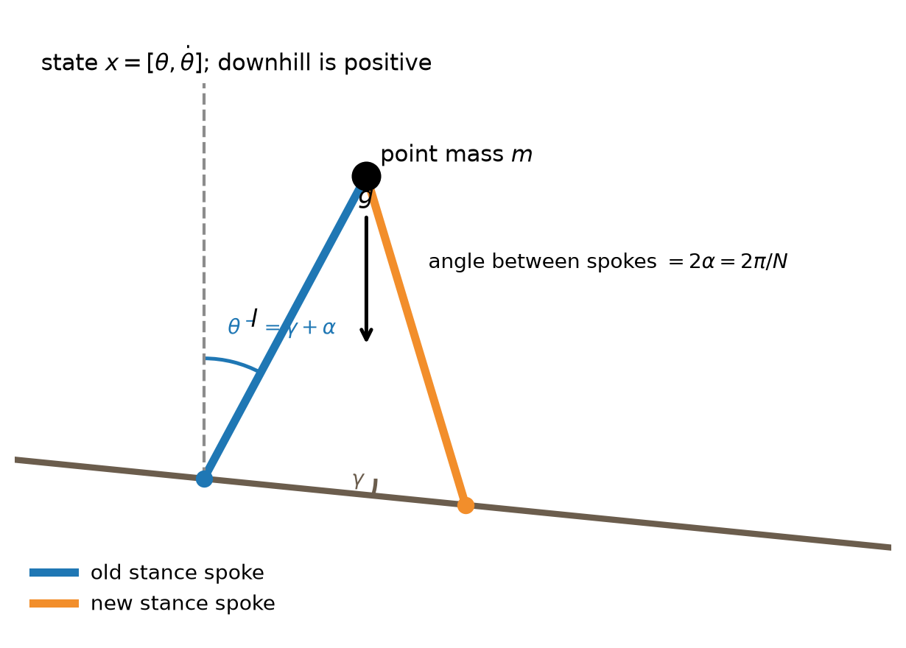
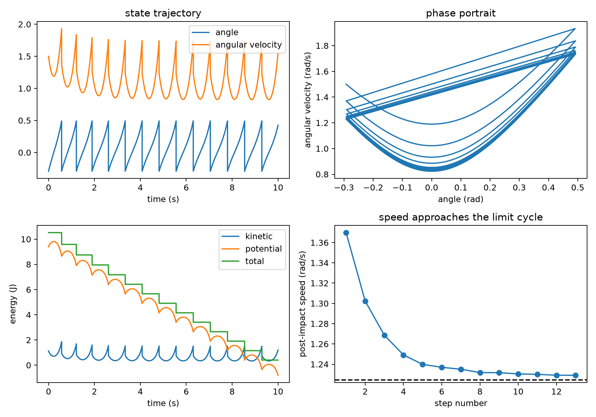
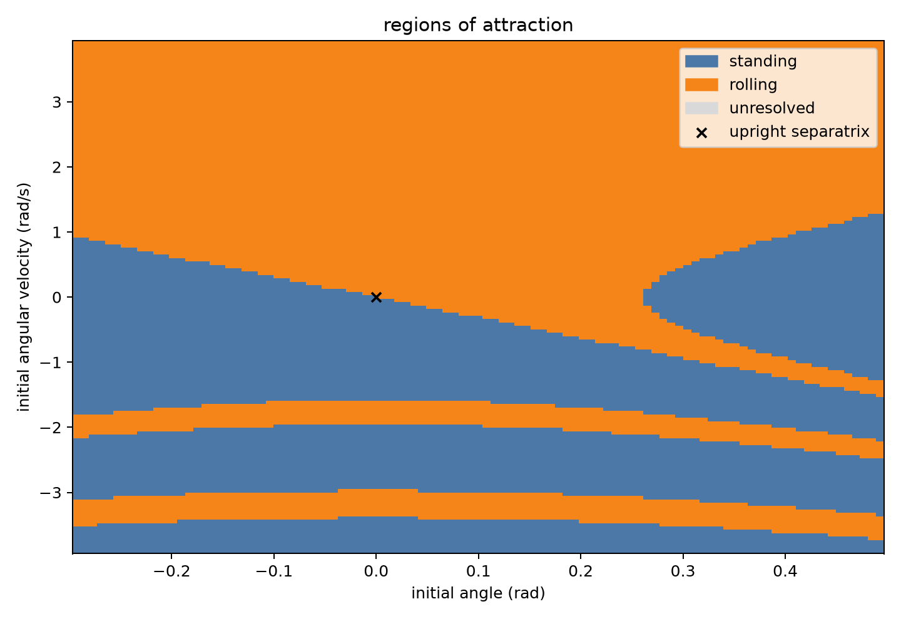
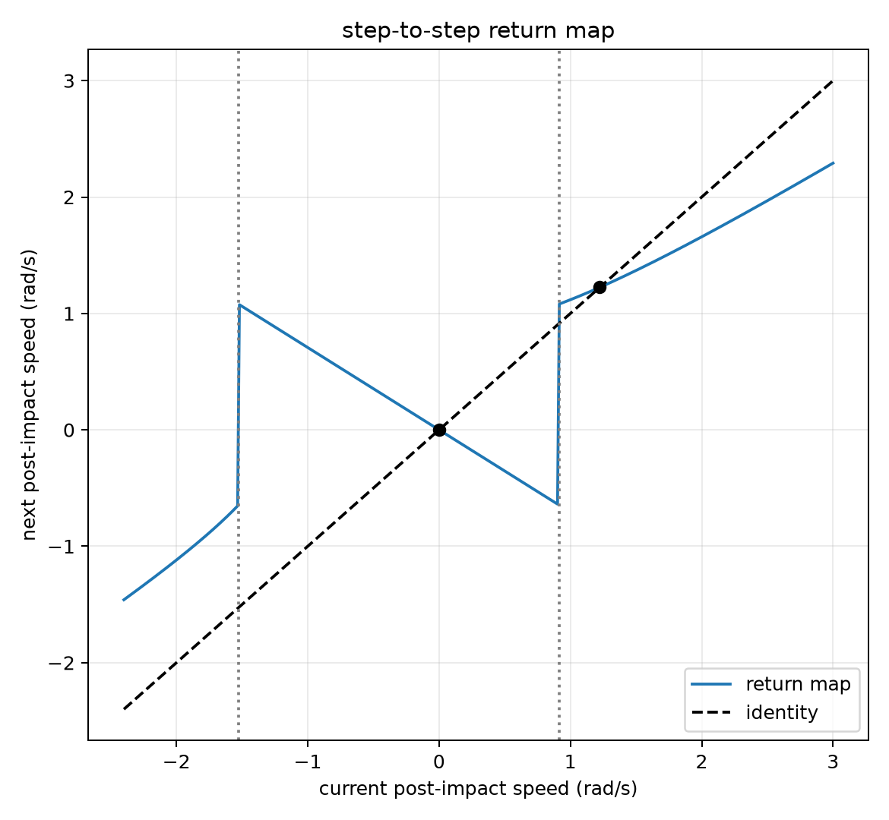
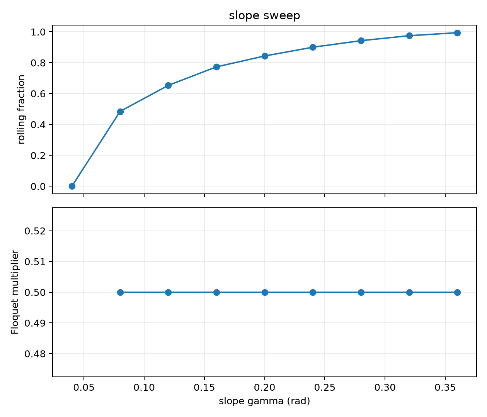
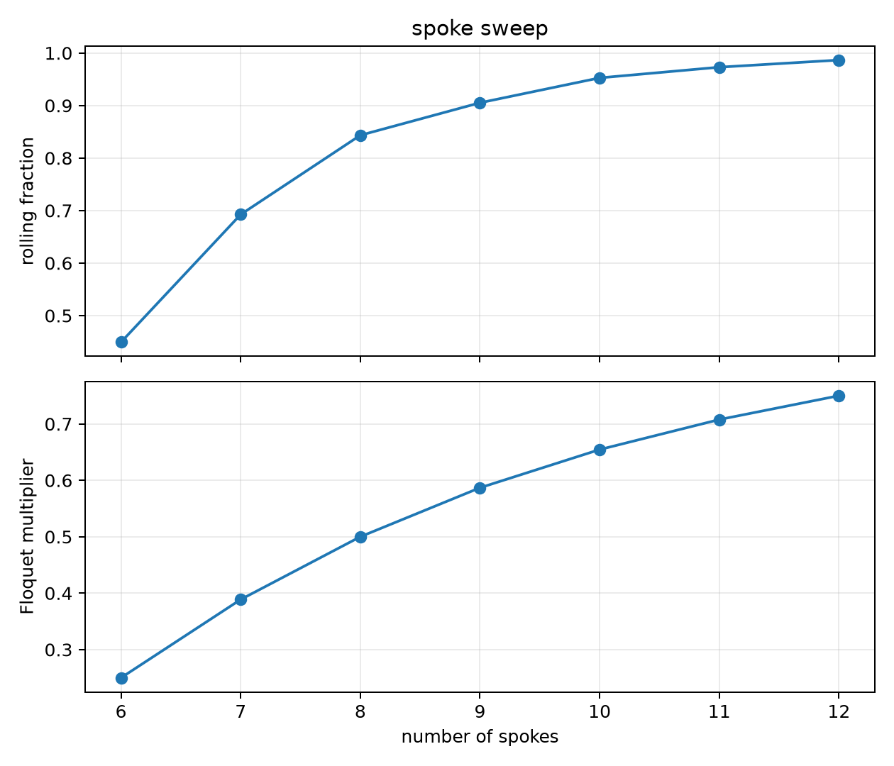

# Assignment 1: Rimless Wheel

## Reproducing the experiments

These outputs are written to `assignment_1_results/`.

```console
uv run python assignment_1.py sanity
```

Runs a short rolling simulation. It saves `sanity_checks.png`. The plot should
show the state trajectory, the phase portrait, energy during the motion, and
post-impact speeds approaching the rolling cycle.

```console
uv run python assignment_1.py roa
```

Estimates the regions of attraction on a state-space grid. It saves
`region_of_attraction.png`. With the default parameters, about 57.31% of the
sampled states roll and about 42.69% settle to standing.

```console
uv run python assignment_1.py return-map
```

Plots the one-step Poincare return map and the identity line. It saves
`return_map.png`. The rolling fixed point should be near 1.224397 rad/s.

```console
uv run python assignment_1.py floquet
```

Perturbs the return-map fixed point on both sides. It saves `floquet.json`.
The centered Floquet multiplier should be about 0.499994, close to the exact
value 0.5.

```console
uv run python assignment_1.py slope-sweep
```

Sweeps the ground slope for an eight-spoke wheel. It saves `slope_sweep.csv`
and `slope_sweep.png`. The rolling basin grows as the slope increases; at
`gamma = 0.04` rad there is no rolling fixed point.

```console
uv run python assignment_1.py spoke-sweep
```

Sweeps the number of spokes from 6 to 12 at `gamma = 0.2` rad. It saves
`spoke_sweep.csv` and `spoke_sweep.png`. More spokes increase the rolling basin
in this bounded grid, but the per-step Floquet multiplier also increases.

## Sketch




## Sanity checks

I checked three things before doing the stability plots:

1. The angle should reset by $2\alpha$ at each step.
2. Mechanical energy should be smooth during a swing and should drop only at
   plastic impacts.
3. A rolling initial condition should approach a repeatable post-impact speed.

The command

```console
uv run python assignment_1.py sanity
```

uses the default parameters and starts at the post-impact angle with
$\dot\theta = 1.5$ rad/s. The last post-impact speed from the run is
1.229089 rad/s, close to the return-map fixed point of 1.224397 rad/s.



## Regions of attraction

For the region-of-attraction plot, I sampled the single-stance interval

$$
\theta\in[\gamma-\alpha,\gamma+\alpha]
$$

and angular velocities in

$$
\dot\theta\sqrt{l/g}\in[-1.25,1.25].
$$

To keep the brute-force grid fast, I used energy to move each initial condition
to its next contact, then iterated the signed step-to-step map. This avoids
taking tiny fixed timesteps near every nonsmooth impact.

There are two stable attractors in the sampled window:

- standing, reached by low-energy rocking steps; and
- the downhill rolling limit cycle.

For the default grid, the rolling basin is 57.31% of the sampled states and the
standing basin is 42.69%.



## Return map and Floquet multiplier

The Poincare section is the state immediately after impact. On the downhill
rolling branch,

$$
P(\omega)=c\sqrt{\omega^2 + A},
\qquad
c=\cos(2\alpha),
\qquad
A=4{g\over l}\sin\alpha\sin\gamma.
$$

The identity-line intersection gives the rolling fixed point:

$$
\omega^* = 1.224397 \text{ rad/s}.
$$



Using a 1% perturbation on both sides of the fixed point gives

| estimate | value |
|---|---:|
| left slope | 0.498744 |
| right slope | 0.501244 |
| centered Floquet multiplier | 0.499994 |
| exact multiplier, $\cos^2(2\alpha)$ | 0.500000 |

Because the multiplier is less than 1, the rolling gait is locally stable.

## Slope sweep

For $N=8$, the rolling basin grows as the slope increases.



| $\gamma$ (rad) | rolling basin | fixed speed (rad/s) | multiplier |
|---:|---:|---:|---:|
| 0.04 | 0.00% | no cycle | N/A |
| 0.08 | 48.46% | 1.0955 | 0.5000 |
| 0.12 | 65.31% | 1.3408 | 0.5000 |
| 0.16 | 77.31% | 1.5467 | 0.5000 |
| 0.20 | 84.34% | 1.7272 | 0.5000 |
| 0.24 | 90.01% | 1.8893 | 0.5000 |
| 0.28 | 94.26% | 2.0371 | 0.5000 |
| 0.32 | 97.48% | 2.1734 | 0.5000 |
| 0.36 | 99.42% | 2.3000 | 0.5000 |

The slope changes how much energy gravity adds during a step, so it changes the
basin and the fixed-point speed. For this ideal model, it does not change the
local per-step multiplier for a fixed number of spokes.

## Spoke sweep

For $\gamma=0.2$ rad, increasing the number of spokes makes the next contact
closer in angle, so more sampled states can keep rolling.



| $N$ | rolling basin | fixed speed (rad/s) | multiplier |
|---:|---:|---:|---:|
| 6 | 44.95% | 1.1399 | 0.2500 |
| 7 | 69.25% | 1.4667 | 0.3887 |
| 8 | 84.34% | 1.7272 | 0.5000 |
| 9 | 90.52% | 1.9460 | 0.5868 |
| 10 | 95.26% | 2.1363 | 0.6545 |
| 11 | 97.29% | 2.3060 | 0.7077 |
| 12 | 98.65% | 2.4603 | 0.7500 |

The tradeoff is convergence per step. Six spokes has the smallest multiplier
and rejects a perturbation fastest per step, while twelve spokes has the
largest rolling basin in this grid.
