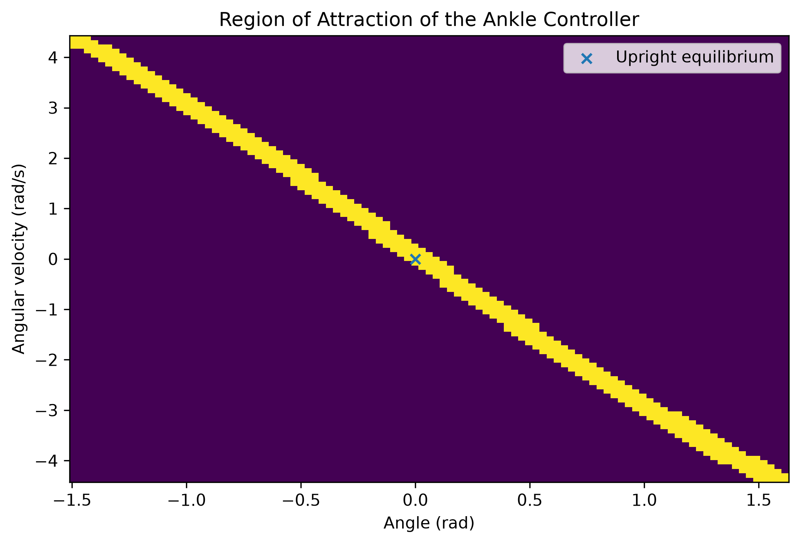

# Assignment 2 Report

## Sketches

## 1. Feedback linearization and RoA

## 2. Poincare section

I used the mid-stance section $\theta=\gamma$ because it does not change with the chosen $\alpha$. Since $\theta$ is fixed, only $\dot{\theta}_k$ is needed as the state in the return map. The section is transverse to forward walking because $\dot{\theta}>0$ when the walker crosses it.

## 3. Lookup table

The state grid covers theta_dot in [0, sqrt(2 g / l)]. The control grid covers alpha in [pi/8, pi/7]. I used the coarsest grid from the table below that satisfied both checks: 
- nearest-neighbor state max rounding error $\le$ 0.010 rad/s
- alpha spacing $\le$ 0.0015 rad.

| speed count | control count | speed spacing | alpha spacing | max rounding error | passes |
| --- | --- | --- | --- | --- | --- |
| 151 | 31 | 0.029530 | 0.001870 | 0.014748 | False |
| 201 | 31 | 0.022147 | 0.001870 | 0.011065 | False |
| 251 | 31 | 0.017718 | 0.001870 | 0.008857 | False |
| 251 | 41 | 0.017718 | 0.001402 | 0.008858 | True |

151x31 failed both, 201x31 failed both, 251x31 passed max rounding error check but failed alpha spacing check; 251x41 passed both and is thus chosen.

